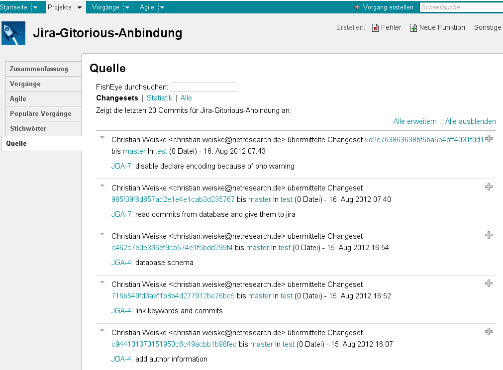

*******************************************
Klonfisch, the FishEye simulator for GitLab
*******************************************

Implements the Atlassian FishEye__ API for GitLab__, so that
you can view GitLab commits in JIRA__.

It's better than all the JIRA Git plugins because it displays the commits
in a separate "Source" tab instead of adding a comment or activity for each
commit.

__ http://atlassian.com/software/fisheye/
__ https://gitlab.com/
__ http://atlassian.com/software/jira/

.. contents::

========
Features
========

- Simulates a part of the FishEye API
- Works with the JIRA FishEye plugin 5.0.7, 5.0.10 and 7.0.13
- Shows commits on issues (Tab "Source")
- Shows commits for projects (Tab "Source")
- `Search for a ticket number <search.php>`_ and get the commit history
- Show the commit history in JIRA Cloud with the `Greasemonkey script </scripts/commitHistoryforJira.php#.user.js>`_

Missing features
================
- Showing files that got changed in a commit.
- Project statistics
- Authentication - everyone can see all commits
- Activity streams

===========
Screenshots
===========
.. figure:: doc/issue-source.png
   :height: 200px
   :target: doc/issue-source.png

   JIRA's issue source tab

   JIRA's project source tab

============
How it works
============
Klonfisch is a PHP application that sits between JIRA and GitLab.

GitLab sends commit information to Klonfisch which stores them
in a MySQL database.
This is done via "web hooks".

JIRA on the other hand talks to Klonfisch, asking for commit information
for projects or single issues.
Klonfisch searches in the commit database and returns them to JIRA.
JIRA then displays the commits in the "Source" tab of issues and projects.

You just have to install the FishEye plugin for JIRA, which takes care of
talking to Klonfisch and the commit visualization.

============
Dependencies
============

- PHP 5.3+
- Apache with ``mod_rewrite`` enabled
- MySQL (or any other database supported by PDO)

=====
Setup
=====

Klonfisch setup
===============
1. ``git clone`` the klonfisch git repository
2. Create a (MySQL) database to store the commits in
3. Import ``data/database.sql`` into that database
4. Copy ``data/klonfisch.config.php.dist`` to
   ``data/klonfisch.config.php`` and adjust it to your environment.
5. Setup your (apache) webserver by adding a virtual host and pointing its
   document root to ``$klonfisch/www/``
6. Execute ``curl -I http://klonfisch.example.org/rest-service-fe/server-v1``
   and if you get a ``401 Unauthorized``, you have done everything correct

Until v1.1.1
-----------------------
Delete all entries of a repository that have the same hash and keep only the entry with the highest branch.

#. Import ``data/migrations/001-duplicate.sql`` into the database

GitLab setup
============
Klonfisch keeps record of commits to your GitLab instance via web hooks.
You can setup them manually in the database, or let Klonfisch create the
hooks automatically.

Manual configuration
--------------------
In every GitLab project (repository), you have to do this:

#. In GitLab project settings, click "Web Hooks"
#. Add a new Web Hook for commits only, to the URL  ``http://klonfisch.example.org/webhook-call.php``

Automatic configuration
-----------------------
Make a copy of ``data/gitlab-klonfisch.sql.dist`` and replace
``http://klonfisch.example.org`` with your klonfisch domain.

Then let cron run the following command every hour on the GitLab server::

    gitlab-rails dbconsole < gitlab-klonfisch.sql

GitLab will then call ``/webhook-call.php`` for each single commit
to a repository.

JIRA setup
==========
1. Install the FishEye plugin. Just installation, no configuration
2. Go to Administration / Applications / Application Links
3. Click "Add Application Link"
4. Set the Server URL, e.g. ``http://klonfisch.gitlab.example.org/``
5. Disable ``Also create a link from "klonfisch" back to to this server``
6. Finish the application link setup

Hide the review buttons:

#. Click "Configure FishEye Server" in the application links list
#. Set "Integration setup" to "FishEye integration only"

That's it. You do not need to setup any authentication.
You do not need to setup any project connections.

Now do a commit, mentioning the issue number (e.g. "JGA-11") in the commit
message.
You will see the commit in JIRA's "Source" tab.

============
Known issues
============

Also see `Missing features`_.

Clicking on repository links does not work
==========================================
Klonfisch simulates only one git repository, mainly to reduce the number
of requests from JIRA.
(helpful if you have 700+ repositories, and 200+ repositories for a single
JIRA project)
This leads to the issue that only the repository "test" is shown for
the commits, even though they are from a different repository.

Use the branch link instead (``master in $project/$repo``).

Removing application links
==========================

After removing an application link, you need to disable the
FishEye plugin and re-enable it again.

If you fail to do so, you will see errors like

 This list may be incomplete, as errors occurred whilst retrieving
 source from linked applications:

 Repository test on http://klonfisch.example.org/ failed:
 The application link with id '46bc9c7c-0bad-3503-9ddf-0123456789ab'
 was not found for instance 'FishEyeInstanceImpl...'

=======
Testing
=======
Search for commits::

  https://klonfisch.example.org/rest-service-fe/changeset-v1/listChangesets/?expand=&rep=test&comment=ABC-1

===============
About Klonfisch
===============

License
=======
Klonfisch is licensed under the `AGPL v3`__ or later.

__ http://www.gnu.org/licenses/agpl

Author
======
Christian Weiske, `Mogic GmbH`__

__ http://mogic.com/

Homepage
========
Klonfisch is available at https://github.com/mogic-le/klonfisch
